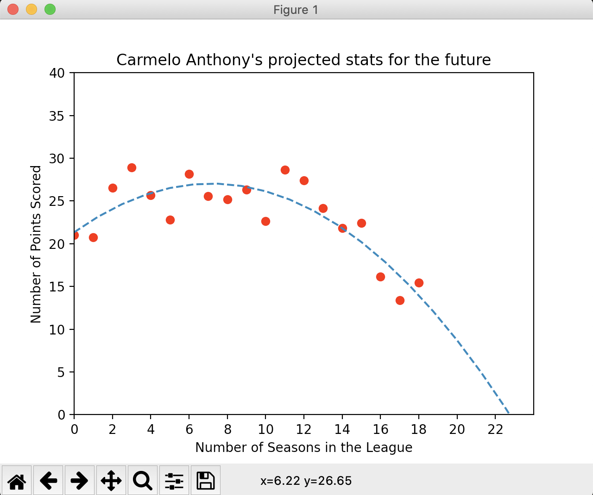
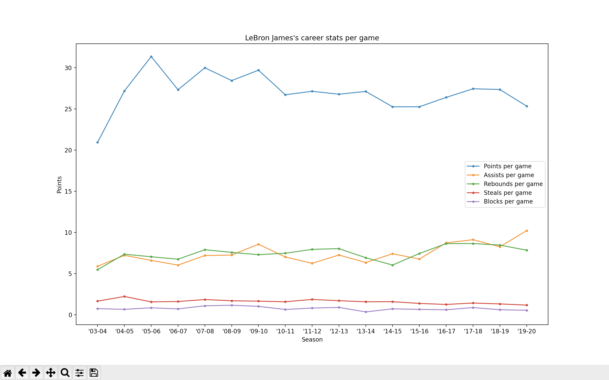

# NBA-Stats-Visualizer

This is a python program that uses matplotlib and selenium to scrape data from https://www.basketball-reference.com and graphs a given player's career averages using pyplot.

Example of the predictive plot:

Example of an overall career plot:

